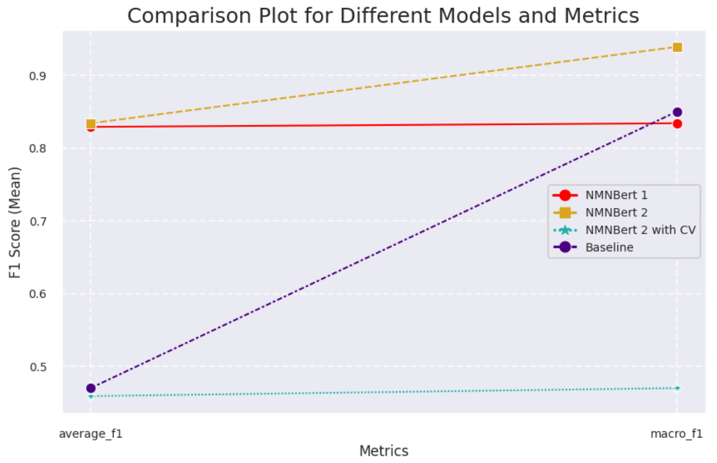

# Memory-Augmented-BERT-for-Fairness-Classification

This paper presents NMNBert, a memoryaugmented neural network that uses contextual explanations to efficiently classify texts. Initially, a baseline model that used cosine similarity to find pertinent explanations obtained a high Macro F1 score of 0.85. By introducing a trainable memory module with read and write heads, NMNBert improves computational performance by removing the need for similaritybased retrieval and storing and retrieving explanations dynamically. NMNBert variants with and without LSTMs, as well as a configuration evaluated using 5-fold cross-validation, consistently obtained a Macro F1 score of 0.47. NMNBert exhibits significant efficiency gains, cutting training time by 67% and memory use by more than 75%, despite the performance disparity, making it ideal for environments with limited resources. Memory-augmented models have the ability to provide scalable and efficient classification tasks. Figure 1: Model architecture

    

    Figure 1: Model architecture

 

# Evaluation

    

 

    Figure 2: A comparison of the metrics across different models

 
